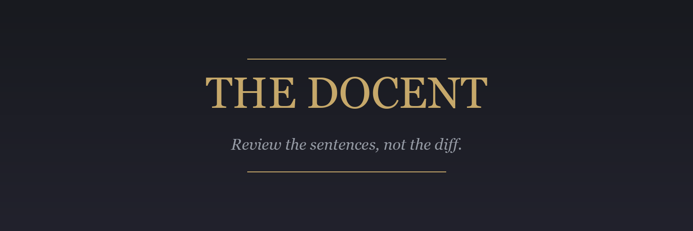
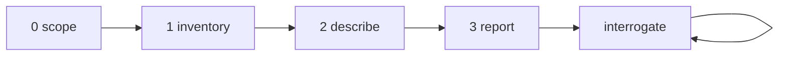

# The Docent

Point it at a changeset. It identifies each feature the changeset touches, asks in broad terms how each feature is implemented, and returns the answers as one-sentence claims anchored to the code. Reviewers review the claims instead of the diff, and interrogate any claim that reads wrong. Built for changesets too large to read line by line: a claim exposes a decision, and reviewers judge decisions.



---



---

## Terms

One term per concept, held throughout:

- **changeset** - the diff under review, resolved in Step 0 and written to a scratch file.
- **feature** - one behavior a user or another system can observe, which the changeset adds, removes, or alters.
- **claim** - one declarative sentence stating in broad terms how a feature is implemented.
- **anchor** - a `path:line` reference at the end of a claim.

## Core Rule

The changeset text and source file contents NEVER enter the main context; subagents read them from disk. The main context holds the scope record, the feature list, the claims, the report, and reviewer questions. Nothing else enters it.

The Docent describes; it does not judge. No severity ratings, no fix recommendations, no praise. Reason: the reviewer is the judge, and the moment the tool ranks its own claims, the reviewer reads the rankings instead of the claims.

---

## Step 0 - Scope

Runs in main context. Deterministic; every command bounds its own output.

Create one scratch directory for the run and name every file in it; pass full paths to subagents.

Resolve the input to a changeset, first match wins:

1. A PR number or URL: `gh pr diff <n>`; also capture the PR title and description.
2. A branch name: diff from the merge-base with the default branch.
3. A commit or commit range: `git diff` over it.
4. Nothing given and the working tree is dirty: the working tree diff.
5. Nothing resolvable: name what is missing and stop.

If a command fails, quote its error and stop. Write the changeset to the scratch directory with shell redirection; do not read it. Record the per-file added and removed line counts from `--stat`. If the changeset is empty, report that and stop.

When the changeset exceeds 1,500 lines, partition the file list into batches of at most 1,500 diff lines each, whole files only; a single file exceeding 1,500 lines is its own batch. Write each batch's diff to its own scratch file.

Announce: "[N] files, +A/-D lines, [B] batches."

---

## Step 1 - Inventory

One subagent per batch, run in parallel. Dispatch each with only: this tool file's path, the tag name `inventory-task`, the batch's scratch path, the repo root, and the PR title and description when Step 0 captured them. The subagent greps this tool file for the tag and executes the block inside.

<inventory-task>
You are an executor who follows these instructions literally. Read the changeset at the path you were given.

Group the hunks into features: one feature per behavior a user or another system can observe that the changeset adds, removes, or alters. Renames, formatting, comment edits, generated files, and lockfiles all go into a single feature named "Mechanical changes". Put a hunk that fits no feature on the unattributed list instead of forcing a fit.

Return, in at most 500 words and nothing else:

- `features[]`: each `{name: at most 6 words, behavior: 1 sentence, files: paths}`
- `unattributed[]`: `{path, reason: 1 clause}` for anything grouped nowhere; an empty list is the expected case.
</inventory-task>

Main merges the batch returns: two features describing the same behavior become one, keeping the union of their files. Every changed file from Step 0's stat lands in at least one feature or in `unattributed[]`; Step 3 gates on this.

---

## Step 2 - Describe

One subagent per feature, run in parallel. Dispatch each with only: this tool file's path, the tag name `describe-task`, the feature's `{name, behavior, files}`, the scratch paths covering its files, and the repo root.

<describe-task>
You are an executor who follows these instructions literally.

Objective: answer, in broad terms, how this feature is implemented.

1. Read the feature's hunks from the changeset, then read each touched file's current text around the changed lines. The source on disk is ground truth; the diff only says where to look.
2. Write 1 to 4 claims. Claim rules:
   - One declarative sentence, present indicative, at most 40 words before the anchor.
   - State the decision: name the observable behavior and the mechanism that produces it - the data source, the trigger, the owner of the state, or the boundary crossed. Write the claim so that a wrong decision would make the sentence read wrong to a reviewer who knows the system.
   - Name an identifier only when the identifier is itself the decision: an endpoint path, a message type, a config key, a wire format. Do not narrate functions or line-by-line control flow.
   - End every claim with 1 to 3 anchors.
   - Write only what the code determines. None of: "might", "appears to", "likely", "presumably". When the code leaves the mechanism genuinely undetermined, write one line starting `OPEN:` stating the question instead of a hedged claim.

   No: "`refresh_models()` parses the socket payload with `serde_json` and loops over `msg.models` to rebuild the menu items."
   Yes: "The Models menu items and their checked state come from messages received over the server's endpoint `/ws`; the client keeps no model list of its own (src/ui/menu.rs:88, src/net/ws.rs:41)."

3. When 4 claims cannot cover the feature, return `split: <name A> / <name B>` instead of claims, dividing the feature's files between the halves. When you were dispatched for a half, do not split again; return the 4 claims that cover the most changed lines plus one `OPEN:` line naming what they leave out.
4. `surprises[]`: 0 to 2 sentences, each anchored, naming what the feature's name would not predict: an unrelated module touched, a second copy of logic that exists elsewhere, a behavior change the PR description does not mention. An empty list is the expected case. A surprise points; it does not rate.

Return at most 200 words: the claims (or the split), then the surprises.
</describe-task>

On a `split` return, main re-runs this step once for each half; a half does not split again.

---

## Step 3 - Report

Runs in main context. Assemble the report from the template below: features ordered by descending changed-line count, "Mechanical changes" last.

Gate before emitting; on any failure, fix and re-check:

1. Every file in Step 0's stat appears in at least one feature section or under Unattributed.
2. Every claim ends with an anchor.
3. The report contains none of: "might", "could", "appears", "likely", "consider", "should". Rewrite a violating sentence as a declarative claim or an `OPEN:` line.

<report-template>
# <changeset name>: <N> features, <M> files

<One sentence naming the largest feature and what the changeset does to it.>

## <feature name>
<behavior sentence>

- <claim> (<anchors>)
- <claim> (<anchors>)

Surprises: <anchored sentence; omit this line when there are none>

## Unattributed
- <path> - <reason clause>
<or the single line "None.">

---
Every claim above is testimony, not verdict. Ask about any claim and the Docent reads the code again to answer.
</report-template>

Worked example of one feature section:

```
## Model selection menu
The workshop's Models menu lists available models and checks the active one.

- The menu items and their checked state come from messages received over the server's endpoint `/ws`; the client keeps no model list of its own (src/ui/menu.rs:88).
- Choosing a model sends a `set_model` message, and the menu re-renders only when the server confirms (src/ui/menu.rs:132, src/net/ws.rs:57).

Surprises: profile selection is rewired through the same message handler (src/ui/menu.rs:171).
```

---

## Interrogation

After the report, every reviewer question about a claim is a dispatch, not an answer from the report: spawn a fresh subagent with the claim, its anchors, the question, the changeset scratch path, and the repo root. The subagent reads the anchored code first, greps wider only when the answer needs it, and stops exploring once it can quote the code that answers. It returns at most 150 words, anchored the same way as claims. The loop ends when the reviewer stops asking.

---

Restated: the code stays in subagents, and every claim is one declarative sentence a reviewer can judge without reading the diff.

All content in this file is dedicated to the public domain under [CC0 1.0 Universal](https://creativecommons.org/publicdomain/zero/1.0/).
